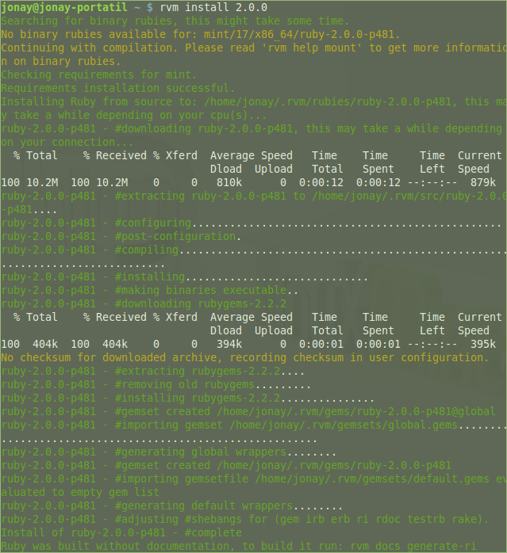
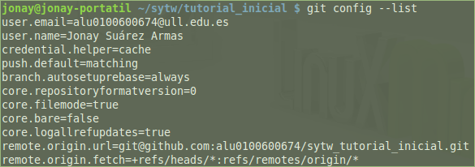

# Tutorial de Tareas Iniciales de la asignatura Sistemas y Tecnologías Web

## Instalación de Ruby (rvm)
Instalaremos la versión rvm de Ruby. Podemos encontrar toda la documentación en http://rvm.io/

Para instalarlo ejecutaremos el comando siguiente (hay que hacerlo como usuario sin privilegios):
~~~
\curl -sSL https://get.rvm.io | bash -s stable
~~~

Si no tiene el programa curl instalado, deberá hacerlo antes.
~~~
sudo apt-get install curl
~~~

Después de haber instalado rvm, instalamos Ruby. En mi caso, la versión 2.0.0.
~~~
rvm install 2.0.0
~~~

## Instalación de Git
Para instalar git:
~~~
sudo apt-get install git
~~~

Una vez instalado procederemos a configurarlo.

Lo primero es añadir un nombre y un correo electrónico.
~~~
git config --global user.name "Nombre Apellido"
git config --global user.email "tu@correo.com"
~~~

Seguidamente, configuraremos git para que no sea necesario introducir la contraseña cada vez que hagamos una actualización.
~~~
git config --global credential.helper cache
~~~

También haremos que todos los cambios se empujen siempre en el repositorio git.
~~~
git config --global push.default "matching"
~~~

Y por último, configuraremos git para que se eviten los commits innecesarios.
~~~
git config --global branch.autosetuprebase always
~~~

Si queremos ver la configuración de git, ejecutaremos el comando siguiente:
~~~
git config --list
~~~

## Instalación de las gemas 